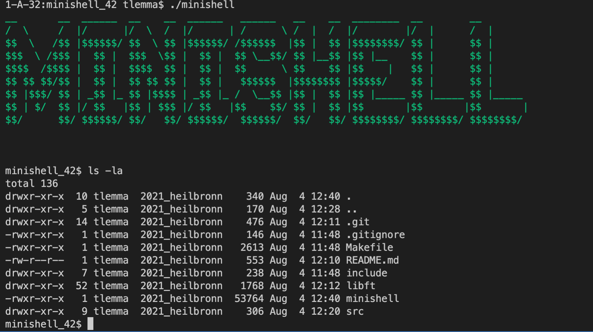

# minishell
A mini bash like shell that can run unix programs and inbuilt functionalities.
Inbuilts include: cd, pwd, export,echo, exit, and more.

## Implementation

This implementation is based on bash, accordingly follows the same lexing, parsing and execution rules. The code base is organized into:
- Lexer
- Parser, and
- Executor
  
Piping, redirections and heredocs are also supported.
## Usage

- `` brew install readline ``
  - <sm>change READLINE and READLINE_INC in Makefile to include the readline library</sm>
- ``make``
- ``./minishell``

